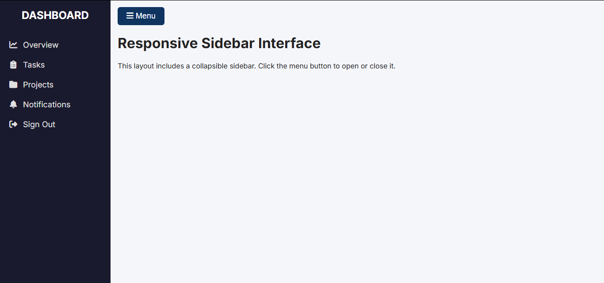

# Task 1: Collapsible Sidebar

## Description

This project features a collapsible sidebar that expands and retracts smoothly with a toggle button.
It includes a logo area, navigation links with icons, and a responsive layout that adjusts seamlessly across different screen sizes.

---

## Tools & Technologies Used

- HTML: Defines the layout and elements of the page.
- CSS: Handles styling, spacing, and responsiveness.
- JavaScript: Controls the sidebar toggle and animations.
- Font Awesome: Provides the icons used in the navigation links.

---
