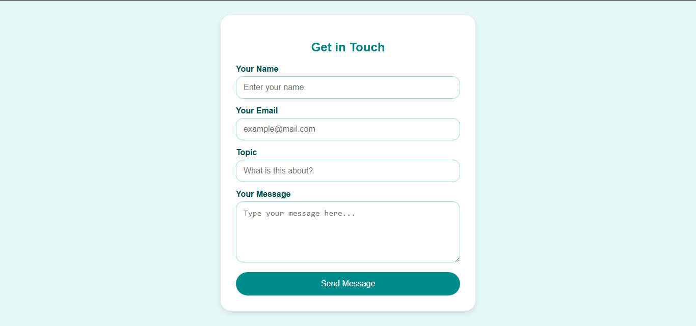

# Task 2: Contact Form

## Description

This project delivers a clean and responsive contact form optimized for desktop and mobile use.
Users can enter their Full Name, Email, Subject, and Message, then submit the form using a sleek Submit button.

---

## Tools & Technologies Used

- **HTML**: Provides semantic form markup.  
- **CSS**: Controls the UI design, grid responsiveness, and styling.  
- **JavaScript**: Implements validation logic.  

---
