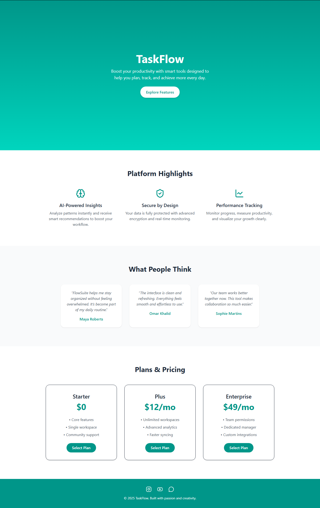

# Task 3: One-Page Website for TaskFlow App

## Description

A sleek, modern one-page website built for TaskFlow, a fictional app designed to revolutionize daily task management and organization.

---

## Tools & Technologies Used

- **React + Vite** → Fast project scaffolding and component-based architecture.
- **Tailwind CSS** → Utility-first CSS framework for rapid, responsive styling.  
- **JavaScript** → Core language for scroll animation handling and component logic .
- **Lucide React** → A collection of beautiful, open-source icons for UI elements.

---

## How to Run

1. Clone or download this repository.  
2. Install dependencies: npm install
3. Start the development server: npm run dev

---
