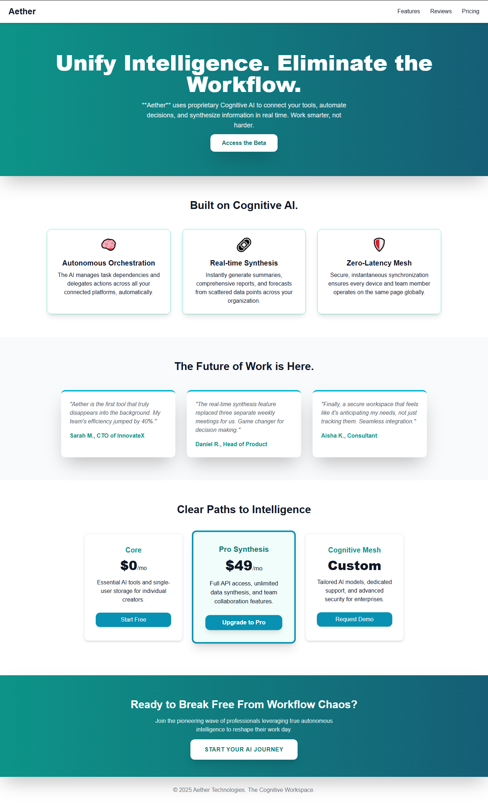

# Task 5: Build a Responsive Landing Page for a Tech Product

---

## Tools & Technologies Used

- **HTML**: Defines the structure and semantic meaning of the webpage’s content.  
- **CSS**: Controls the visual presentation, layout, spacing, and overall styling of elements.
- **Tailwind CSS**: A utility-first CSS framework that speeds up design with pre-built, responsive classes.
- **JavaScript**: Adds interactivity, dynamic behavior, and logic to enhance user experience.

---

## Features

- Sleek, modern, and user-friendly landing page layout
- 100% responsive design that adapts flawlessly to all screen sizes
- Eye-catching hero section with subtle gradients and a strong CTA
- Informative feature cards with clean icons and short summaries
- Authentic testimonials section showcasing real user experiences
- Straightforward pricing plans with clear, no-hidden-fees details
- Strong closing call-to-action designed to boost conversions

---

## How to Run

1. Download or clone the repository to your local machine.
2. Open the project directory in your preferred code editor.  
3. Launch the project by opening index.html in your browser.

No setup, installation, or build steps are needed — this is a fully static project.

---
